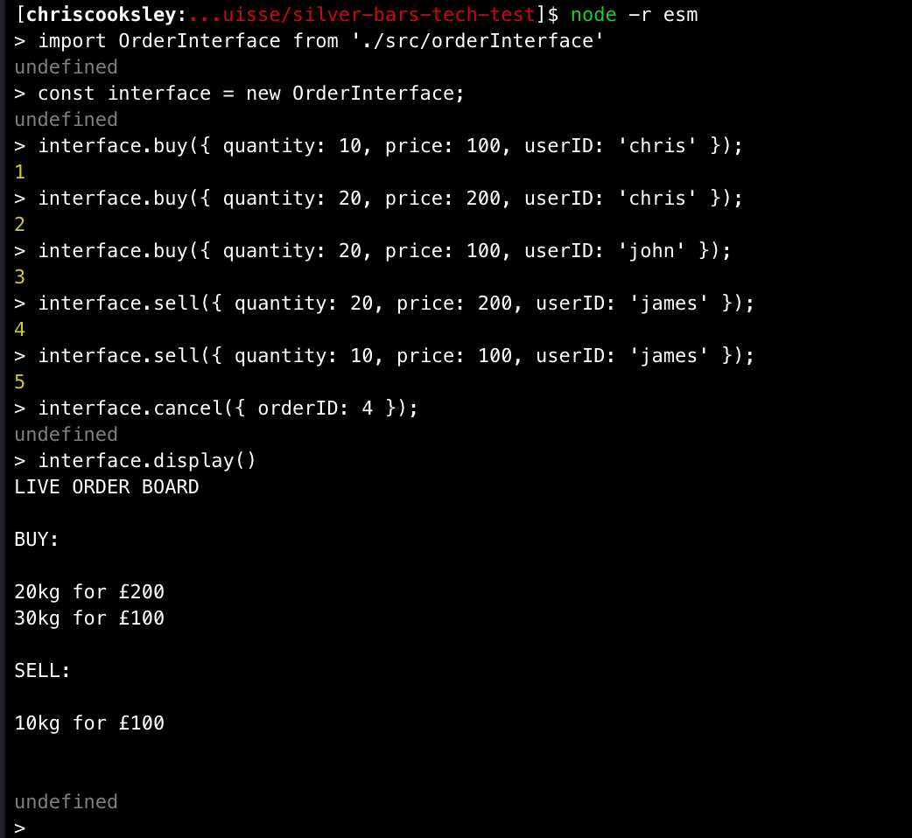

# SilverBars Tech Test

## Description

* A command line application to register orders to buy and sell silver bars in a fictional marketplace, and display a summary of orders to the console.
* Written in Node, tested with Jest and linted with ESLint.
* Completed as a tech test for a Makers hiring partner.

## How to Use

* Clone this repo.
* Install dependencies with `npm install`

### Testing

* Run `jest --coverage` to run unit and feature tests and see coverage. This should be at 100%.
* Run `jest --verbose` to see tests in a documentation-like format

### Interacting with the program

* Run `node -r esm` to open the Node REPL with `esm` required. [esm](https://www.npmjs.com/package/esm) is a package that allows the use of ES6 modules, including `import`/`export` syntax, in Node.
* Run `import OrderInterface from './src/orderInterface';` to import the interface class.
* Run `const interface = new OrderInterface();` to create a new interface.
* To register to buy or sell silver bars, use the following command structure to provide the quantity, price and userID:
```
interface.buy({ quantity: 1, price: 100, userID: 'Chris' })
interface.sell({ quantity: 2, price: 200, userID: 'Chris' })
```
* To cancel an order, use the order ID returned when registering that order:
```
interface.cancel({ orderID: 1 })
```
* To display all orders, use the `display` command:
```
interface.display()
```

* See the screenshot below for examples of interactions with the interface:



## Design Decisions

### Structure

* I followed principles of object-oriented design by dividing my code into several small classes each with a single responsibility:
  - Order holds information about a single order.
  - AggregateOrder holds information about a single aggregation of orders at a given price.
  - OrderBoard manages an array of active orders.
  - OrderBoardSummariser summarises an OrderBoard, producing an array of AggregateOrders
  - OrderBoardView 'renders' an OrderBoard by formatting and printing a summary of it to the console.
  - OrderInterface handles user requests to interact with the OrderBoard by sending messages to the above classes.
* I aimed to enforce a separation of concerns by constraining display logic to the OrderBoardView class, and user interaction logic to the OrderInterface, leaving the other classes to deal with business logic.

### Dependencies

* I used Jest for feature and unit testing as it is familiar to me, easy to write and read, and more than fully featured enough to exercise the functionality of this app.
* I used ESLint with the AirBnB style guide for linting as I understand this to be a popular source of stylistic best practices in the community.
* I used ESM to allow me to use the convenience of ES6 modules while still allowing the app to be interacted with in Node.

### Syntax and Language Features

* I used modern ES6 syntax because many of its features (e.g. arrow functions, classes) make my code easier to understand.
* I used destructuring assignment to allow for named function and constructor parameters. This makes these functions easier to use (one need not remember the type or order of parameters) and removes a dependency on parameter order, making the code more resistant to change.

### Problem Interpretation

* I chose to display BUY and SELL orders in two separate lists, to allow for one to be formatted in decreasing price order and the other in increasing price order.
* I did not create a separate User class as this was not necessary to implement the core features specified.

## Limitations

* I did not have time to implement or test for error handling for edge cases (e.g. orders can be registered with negative or string prices, and one user can cancel another user's order), and so focussed on test-driving the core functionality.
